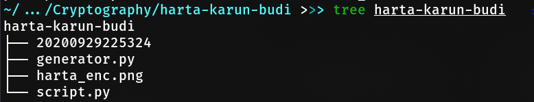

# SOAL HOLOGY CRYPTOGRAPHY #3

### Judul : Harta Karun Budi

### Author : Joule

## Deskripsi

Harta Karun Budi

Andi (bukan nama sebenarnya) merupakan seorang mahasiswa yang memiliki ketertarikan di bidang visi komputer dan kriptografi. Budi yang merupakan sobat akrabnya senang mengumpulkan foto2 "menarik" yang sangat berharga baginya, ia tidak ingin ada orang lain yang bisa melihat gambar tersebut. 
Budi pun meminta Andi membuat algoritma enkripsi untuk mengamankan gambar2nya. 

Budi: "Bro, lu tau kan gw punya banyak gambar yang 'berharga', lu kan jago ngoding bisa gak lu buat supaya yg bisa liat gambarnya gw doang gitu kek make enkripsi2an."

Andi: "Sabi Bro, tapi... wani piro?"

Budi: *nunjukkin rekening sama "koleksinya"*

Andi: "Mantap awoakoawkw, tancap gas bro."

Andi berpesan kepada Budi untuk menyimpan gambar "kunci" agar ia dapat mengembalikan gambar2nya.

Andi: "Nih bro, lu jalanin aja dah tuh programnya ntar ada folder isinya banyak gambar gaje jangan diapus ye bro."

Budi: "Oh iya2, bro sip" *ngangguk2*

Keesokan harinya, Budi bertanya lagi pada Andi karena menemukan masalah.

Budi: "Bro, gw keknya gasengaja apus gambar yg lu bilang anj*y, jd error hasilnya pas gw decrypt."

Andi: "Wadu bro, gmn yak keknya gabisa dibalikin juga kan gambar2 gaje-nya tuh random."

Budi: "Bjirrr, trus gimana bro cara balikinnya ya :' . Mana itu isinya harta gua yang paling berharga lagi"

Andi: "Hmmm, Gua minta tolong temen hekel gua deh bro siapa tau sabi."

Budi: "Ayt."

Andi pun meminta tolong pada anda untuk melakukan dekripsi pada gambar tersebut. Sebagai hekel yang baik dan tidak sombong, bantulah Andi.

## Konsep Soal

### _Kategori serangan: Ciphertext-only (exhaustive key search)_

Crypto, XOR, Pseudo-random, visual cryptography

## Proof of Concept

Diberikan 4 file kira-kira seperti ini strukturnya.

<!-- TODO POC -->

## Hints

Maybe you overlooked something?

## Flag

Tekan untuk melihat flag

    hology3{randomness_and_bruteforce_at_its_finest}

