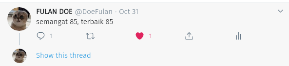

# SOAL HOLOGY FORENSICS #2

### Judul : meong

### Author : EmpalGentong

## Deskripsi

Suatu ketika om Fulan Doe pergi liburan lalu diberi file aneh yang katanya menunjuk ke lokasi harta karun oleh seorang pria pecinta kucing. bantu om Fulan mencari harta karun.

\*\* _format flag = hology3{kota1_kota2}_

\*\* _nama kota lowercase_

## Konsep Soal

Konsep dari soal ini :

- mengetahui recovery menggunakan git
- sedikit osint

## Proof of Concept

Diberi sebuah folder yang berupa git yg didalamnya ada sebuah gambar, extract gambar tersebut maka didapat sebuah file rar yang terproteksi, password didapat dari folder git, menggunakan command untuk mencari file password.txt, contohnya bisa menggunakan :

```
git log --diff-filter=D --summary | grep delete
git log -- [deleted-filename]
git checkout <>
```

buka ImHereDude.txt dan didapat password untuk rar berbentuk string base32 yang jika di decode

```
MiawMiaw
```

lalu extract rar menggunakan password yang sudah didapatkan

maka didapat sebuah base64 yg ketika di decode memberi kita ke sebuah link twitter

```
https://twitter.com/DoeFulan
```

flag pertama terdapat pada postingan gambar


```
/N,4?0JtXD2)Hj,0ebR>2)R6I3&`h
```
jika dilihat pada tweet di twitter, terdapat tweet



yang mengindikasikan flag merupakan base85 string (terbaik 85 -> best85 -> base85)

merupakan base85 string yang jika didecode menghasilkan koordinat

```
-6.7053554, 108.5553879
```

yang merupakan koordinat stasiun di Kota Cirebon

lalu flag ke 2 terdapat di about page youtube yang ada di profile twitter John Doe tersebut

```
/N,4A0JYIF1+XP&0K1UB0fV*N1c[M
```

base85 string yang jika di decode menjadi

```
-6.902492, 107.61877498
```

yang merupakan koordinat gedung sate di kota Bandung

## Hints

_Lihatlah hanya yang ada di depanmu_

## Flag

<details>
<summary>Tekan untuk melihat flag</summary>

    hology3{cirebon_bandung}

</details>
