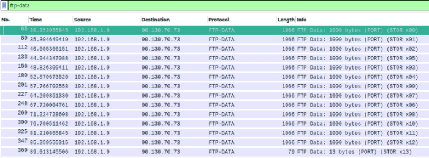
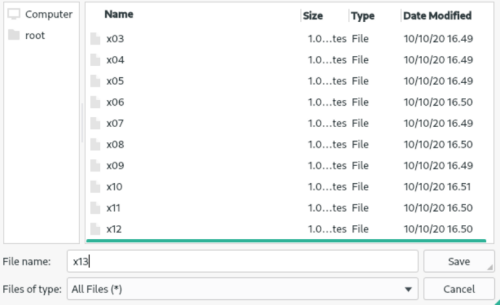
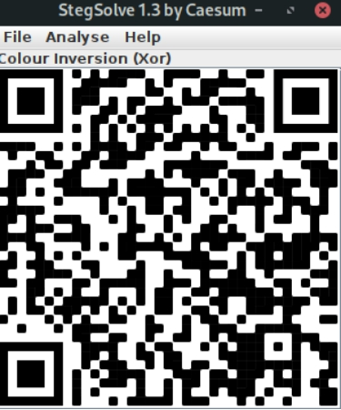
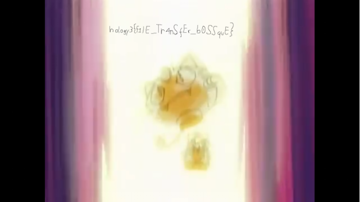

# SOAL HOLOGY FORENSICS #3

### Judul : Puzzle

### Author : rax_3r

## Deskripsi

Collect [all gym badges](https://drive.google.com/file/d/181XNdx80YP-HVjLQn7jslqLLHtEEnAXC/view?usp=sharing) and become the champion.

_file: [puzzle.pcapng](puzzle.pcapng)_

## Konsep Soal

Network Forensics FTP

## Proof of Concept

Didapat sebuah Capture data dengan nama “puzzle.pcapng”

Saat dilihat ada File Transfer Protocol di dalamnya . Dimana FTP biasa digunakan untuk mengirimkan data. Maka lakukan filter “ftp-data”.

Setelah dilakukan filter ditemukan 14 data dengan nama yang memiliki nomor didalamnya.
Lakukan extract setiap data dengan format RAW agar data dapat di jadikan satu tanpa kesalahan. 

Jadikan semua file menjadi satu dan periksa fotmat file yang sebenarnya. Terakhir ubah format nama file sesuai format sebenarnya.

Didapati sebuah QR yang tidak dapat di scan . Gunakan tools untuk menukar warna hitam dan putih dari QR tersebut.

|         Inverted QR          |        Normal QR        |
| :--------------------------: | :---------------------: |
|  |  |

Setelah di scan didapati sebuah file video yang berisikan file flag dengan format zip. Didalam file tersebut terdapat video pendek yang berisi flag didalamnya.

## Hints

<code>None</code>

## Flag

Tekan untuk melihat flag

    hology3{f1lE_Tr4nSfEr_b0SSquE}

