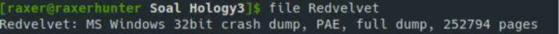
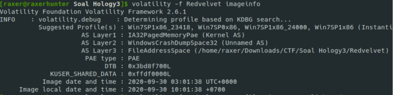
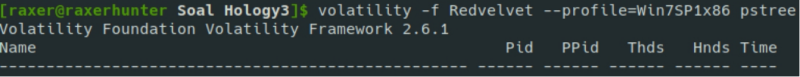
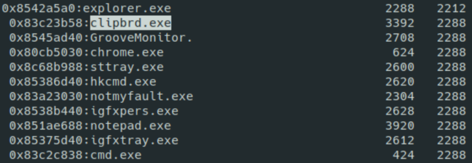
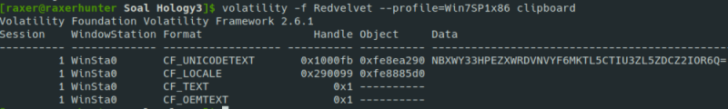
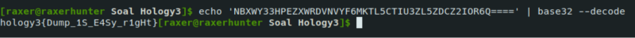

# SOAL HOLOGY FORENSICS #4

### Judul : Red Velvet

### Author : rax_3r

## Deskripsi

Copy [this](https://s.id/rn2By) to address bar... 
seems legit. 

File:
[Redvelvet.zip](https://drive.google.com/file/d/1vlpgZVSWG-jIwaqy4oOnXbIXzz4Pavha/view?usp=sharing)

## Konsep Soal

Memody Dump.

## Proof of Concept

Didapat sebuah file dengan nama Redvelvet

Dapat dilihat dengan menggunakan “File” kita mendapatkan format file tersebut adalah Memorydump dari windows. 

Gunakan Volatility untuk mendapatkan Profile Windows yang digunakan. Kemudian kita dapat menggunakan pstree untuk melihat file apa saja yang dibuka saat pembuatan Memorydump.

Dapat dilihat beberapa program yang dibuka secara manual adalah cmd,notepad, dan clipbrd. Dan ketika melihat isi dari clipboard maka kita mendapatkan file dengan format base32/64 (karena ada “=”).*fitur clipboard sudah dihapus dari default windows sejak windows 7.

Terakhir kita lakukan decode menggunakan base 32 untuk mendapatkan file.

## Hints

<code>None</code>

## Flag

Tekan untuk melihat flag

    hology3{Dump_1S_E4Sy_r1gHt}

